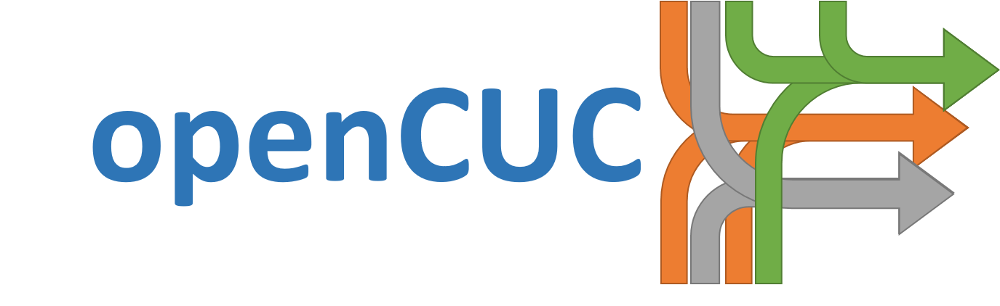
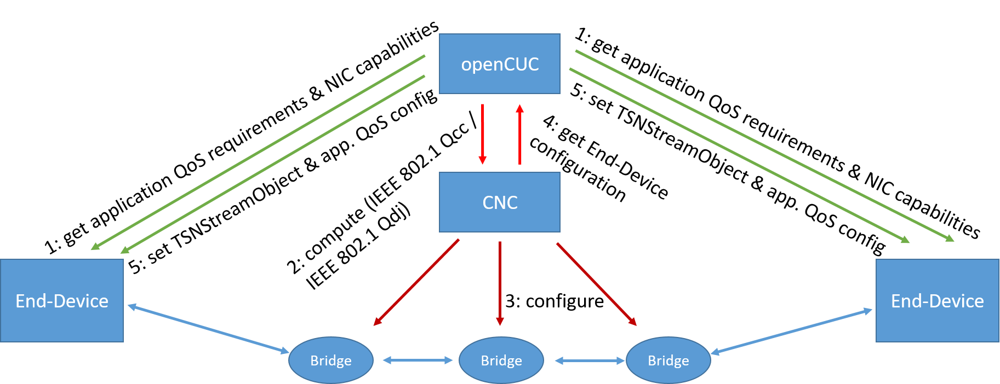

  

 

  <!-- License -->
  

 

  <b>A CUC prototyping framework for OPC UA PubSub over TSN following the centralized configuration model of the IEEE</b>

## Overview
**openCUC** implements a CUC prototype framework and represents an important component in the IEEE's centralized configuration model for [Time Sensitive Networking (TSN)](#New-to-TSN?). The main idea and driving force behind this project are:
* to enable broad OPC UA PubSub over TSN prototyping without the need for everyone to develop its own CUC and
* to support standardization with early implementation feedback.

**openCUC** implements the functionality of the CUC as described [below](#New-to-TSN?). It uses the OPC UA Client/Server mechanism with OPC UA Part 14 and Part 22 Information Models for the exchange of QoS-related information with OPC UA applications. For communication with the CNC, **openCUC** is based on RESTCONF and YANG structures defined in IEEE Std 802.1Qcc-2018 with the intention to move to the new YANG model(s) defined in [IEEE P802.1Qdj](https://1.ieee802.org/tsn/802-1qdj/) in the near future.

The **openCUC** project was initiated by Hirschmann and is co-maintained by Hirschmann and ISW of the University of Stuttgart. Schneider Electric is an active supporter of the project.

## I only see this README. Where is the rest?
 **openCUC** - *intention* was the namesake of this project, not current circumstances. Our intention is to release this project publicly as an enabler for broad OPC UA PubSub over TSN prototyping without the need for everyone to develop its own CUC. Unfortunately, we currently have to restrict access to OPC Foundation members. If you are an OPC Foundation member, request you can access to our private repository via [this form](https://forms.office.com/Pages/ResponsePage.aspx?id=DQSIkWdsW0yxEjajBLZtrQAAAAAAAAAAAAN__iNGgJVUNTNWVzJISUtCQjRJWU5GWUY4SlpHODFVVS4u). For everyone else: **Stay tuned!** The goal is to open this project to the public once underlying specifications have been published. 

## New to TSN?
In case you are not familiar with this next evolutionary step of Ethernet just yet, TSN is a set of Ethernet enhancements developed by the IEEE for the tried and trusted Ethernet technology. It introduces new Quality of Service (QoS) capabilities that enable real-time communication and converged network architectures. Also new with TSN: Applications announce their QoS requirements to and accept their QoS-related configurations from the network when aiming to leverage these new capabilities.

  

 

  <i>Workflow of the centralized TSN configuration model</i>

 

**What is a CUC?**
According to the IEEE's centralized configuration model, the **Central User Configuration (CUC)** is a logical entity that is responsible for retrieving the application-level QoS requirements from the sender- and receiver-side applications. In IEEE jargon, these are called **Talkers** and **Listeners**. After retrieval, the CUC merges Talker and Listener QoS requirements that belong to the same (unidirectional) exchange of application data, so called **Streams**, into end-to-end Stream requirements. The CUC then forwards delegates the computation of adequate paths and transmission configurations to a separate logical entity, the **Central Network Configuration (CNC)**. The final task of the CUC is to distribute the CNC's computed transmission configurations back to the Talkers and Listeners. Importantly, there may be several CUCs active in a network, but only a single CNC - think of the CNC as the communication puppet master. 
